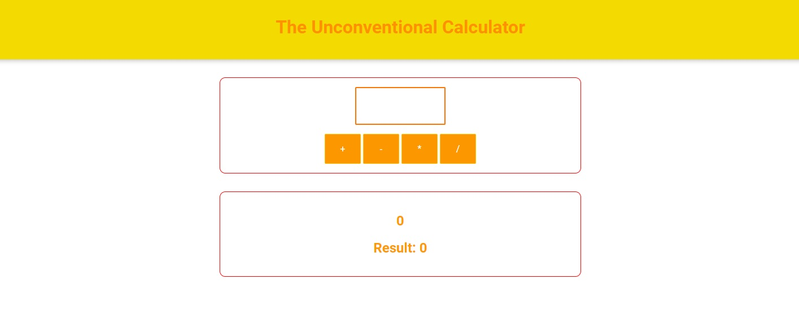

# Calc: Web calculator

## Project description

- A web calculator was made that includes addition, subtraction, multiplication and division

## Languages ​​Used

- JavaScript, HTML and CSS.

## Autor

ex. Mayank Kumar
ex. [@MayankThakurrr](https://twitter.com/MayankThakurrr)
